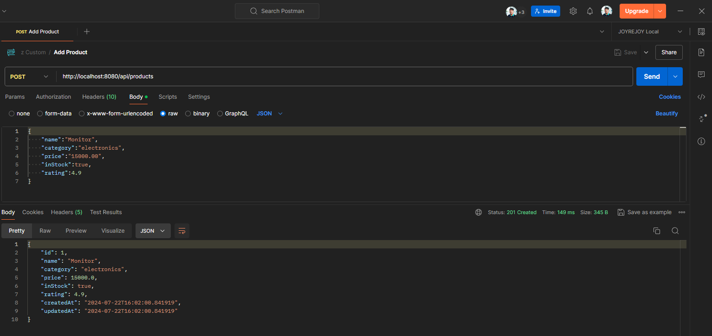
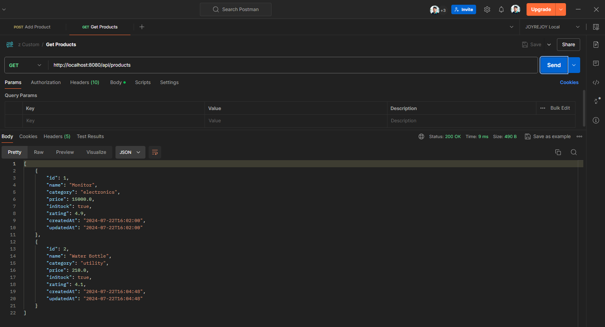

# Product-Management-System

This is a Spring Boot application that interacts with a MySQL database to provide a RESTful API for filtering and sorting product records. The API allows you to fetch product details from the products table with various filtering and sorting options.

## Table of Contents

- [Getting Started](#getting-started)
- [Technologies](#technologies)
- [Running the Application](#running-the-application)
- [API Endpoints](#api-endpoints)
- [Testing](#testing)

## Getting Started

### Prerequisites

- Java 8 or higher
- Maven
- MySQL

### Installation

1. Clone the repository:

    ```bash
    git clone https://github.com/sanajitjana/Product-Management-System.git
    ```

2. Build the project:

    ```bash
    mvn clean install
    ```
3. application.properties
     ```bash
      spring.application.name=Product Management System
      
      spring.datasource.url=jdbc:mysql://localhost:3306/product_db
      spring.datasource.driver-class-name=com.mysql.cj.jdbc.Driver
      spring.datasource.username=root
      spring.datasource.password=
      
      spring.jpa.hibernate.ddl-auto=update
      spring.jpa.show-sql=true

     ```
4. Set Properties:
     ```bash
      Update database username and password
     ```

### Technologies
- Java
- Spring Boot
- Spring Data JPA
- Hibernate
- Lombok
- JUnit 5
  
## Running the Application

1. Run the application:

    ```bash
    mvn spring-boot:run
    ```

2. The application will start on port 8080. You can access the API at `http://localhost:8080/api/products`.

## API Endpoints

## Add Product

Add products in database.

- **URL:** `http://localhost:8080/api/products`
- **Method:** `POST`
  
#### Screenshot of Add Product API



### Get Products

Retrieve the list of products with optional filtering and sorting.

- **URL:** `http://localhost:8080/api/products`
- **Method:** `GET`

#### Screenshot of Get Products API



## Testing

The application includes unit and integration tests to ensure the functionality of the service and controller layers.

### Test Coverage
- ProductServiceTest: Unit tests for the ProductService class.
- ProductControllerTest: Integration tests for the ProductController class.
